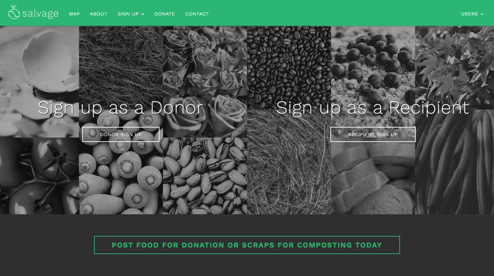
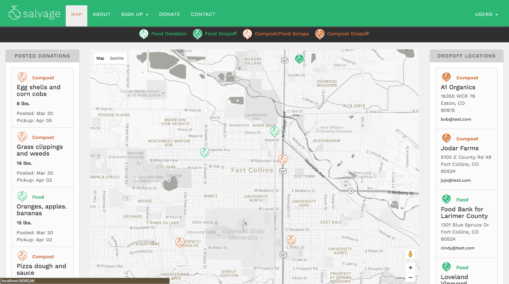
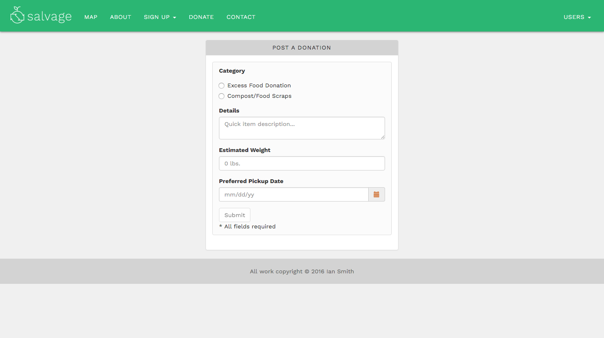

# Salvage

[View Site](http://salvage.firebaseapp.com)

Salvage is a food donation and compost app. It provides users a resource for locations to drop off donations as well as a locator for businesses who accept small donations. This project uses Electron to package the Angular app as a native desktop application available for download on OSX, Linux, and Windows.

### Tech Notes
* HTML
* CSS/SASS
* JavaScript
* Node
* Angular
* Electron
* Express
* PostgreSQL
* Waterline

